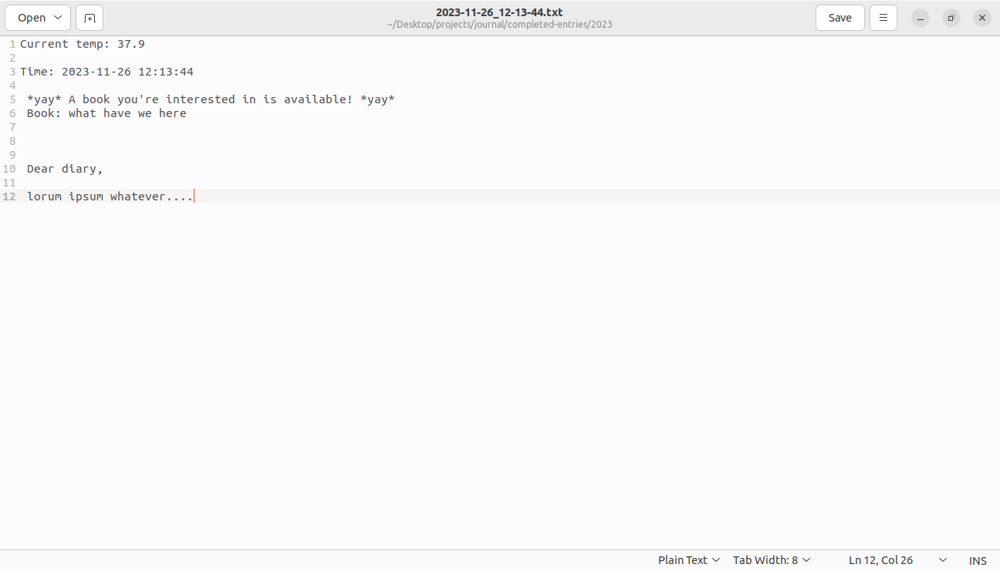
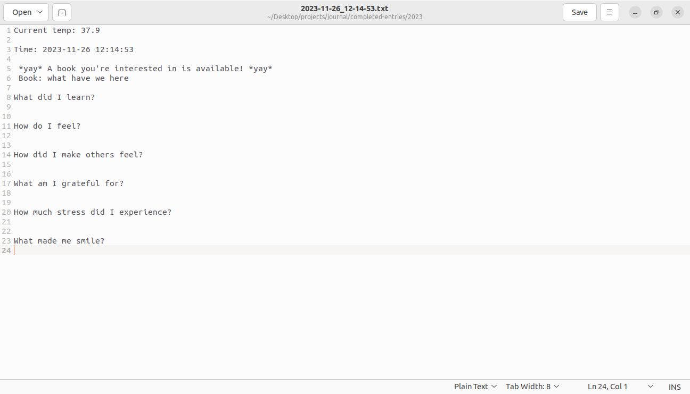

## journal-script

A way to journal easily and without distraction. 





## What Files Are Important? 

Two main files for understanding this project are: 

**makeNewEntry.py** : python file that spins up a fresh .txt document for you 

**write.sh** : bash script that takes care of directories and such

That's the skeleton.

## How to Run:

Download the requirements.txt if you want the library querying to work, otherwise comment out that part of makeNewEntry.py. If you want weather to work you have to get an API key (free), & make a .env off the template with your zip code & key, but it works fine without that too you just don't get to see your temperature.

Cd into 'journal-script', run:

```./write.sh```

A plaintext file will be created and opened for you. Go nuts typing away whatever you'd like to say, save it, then close the file. The file will then be saved in completed-entries/2023, with the timestamp as its title. 

Currently set up for mac and linux. 

## Extras

### Optional flag


```./write.sh -p```

will open up a plaintext file with prompts if you prefer a little structure.



### Header info

#### Time & Date
Nice to know, but also potentially useful down the line to make your journal entries nice and organized for potential future analysis/exploration/messing around with. 

#### Weather 
weatherChecker.py (in /scripts) queries weatherapi.com & then returns current temp (need API key & zip code in .env to work (API works for me on free tier)).

#### Library
This one is a little more involved & specific to my life but basically queries my local library to see if newly-released books have been added to their system yet. Not terribly fancy, it uses URL-manipulation to search for the titles, and then BeautifulSoup parses the html & we just count up the elements that correspond to search results, and if that number is different than the number of search results the query generated when the book was added to books.json (& this new book I'm interested in wasn't in the system), it lets you know. 

To CRUD book titles (or at least create and delete them), cd into /scripts and then:

add:
```
python3 books.py -add 'number go up'
``` 
list
```
python3 books.py -l
``` 
remove
```
python3 books.py -rm 'number go up'
``` 
## My Motivations (in making this)

- baby's first bash script!
- trying to automate parts of my life for practice, even when the automation takes longer than the task itself
- framework for future scripts I want to run somewhat regularly but don't want to bother putting on the cloud or whatever
- get my journalling off the cloud because:
    - maybe I'll be more focused when I can't literally see other tabs I have open while journalling
    - maybe having the raw journal text already in .txt and organized by date will be nice down the line for text-analysis exploring stuff
- (library script specifically) baby steps towards like other automated web stuff
- code up something that I then actually use & can iteratively improve on

Thank you for reading! Feel free to borrow/improve/steal anything. 
